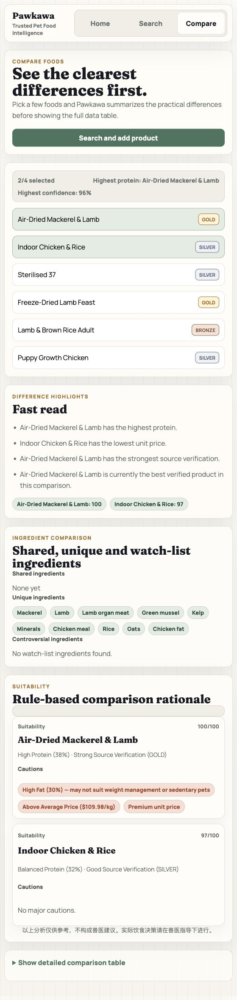

# Build Verification Report

Date: 2026-06-14  
Project: Pawkawa  
Repository: `https://github.com/libazza91-svg/pawkawa`

## Scope

This report verifies the current stabilization baseline before deciding whether to move into:

- Pet Intelligence Layer 深化
- Verified Product API + Compare Product V1

## Summary

Required verification status:

- `backend npm run build`: PASS
- `frontend npm run build`: PASS
- `backend npm test`: PASS
- `frontend lint`: N/A, not configured
- Compare API 实际联调: PASS
- Intelligence API 实际返回示例: PASS

Decision status:

- Required build and runtime verification items are complete.
- The project is ready for product-direction review.

## Verification Details

### 1. Backend Build

Command:

```bash
cd /Users/barryli/Desktop/PetFoodCompare/backend
npm run build
```

Result:

- PASS
- TypeScript build completed with exit code `0`

### 2. Frontend Build

Command:

```bash
cd /Users/barryli/Desktop/PetFoodCompare/frontend
npm run build
```

Result:

- PASS
- Vite production build completed with exit code `0`

Output excerpt:

```text
dist/index.html                   0.65 kB
dist/assets/index-pi0KgrXy.css   13.06 kB
dist/assets/index-DbnHHnEF.js   179.15 kB
✓ built in 1.47s
```

### 3. Backend Tests

Command:

```bash
cd /Users/barryli/Desktop/PetFoodCompare/backend
npm test
```

Result:

- PASS
- `21` test files passed
- `245` tests passed

Output excerpt:

```text
Test Files  21 passed (21)
Tests       245 passed (245)
Duration    5.09s
```

### 4. Frontend Lint

Frontend package scripts currently contain:

- `dev`
- `build`
- `preview`

Result:

- N/A
- No frontend lint script is configured in `/Users/barryli/Desktop/PetFoodCompare/frontend/package.json`

## Live API Verification

### 5. Compare API Live Integration

Request:

```bash
curl -s -X POST http://127.0.0.1:3001/api/compare \
  -H 'Content-Type: application/json' \
  -d '{"product_slugs":["ziwi-peak-air-dried-mackerel-lamb","black-hawk-indoor-chicken-rice"]}'
```

Result:

- PASS
- Backend returned real comparison payload
- Frontend compare page rendered comparison summary, ingredient differences, and suitability rationale

Screenshot:



Screenshot file:

- `/Users/barryli/Desktop/PetFoodCompare/artifacts/compare-api-live.png`

API response excerpt:

```json
{
  "success": true,
  "data": {
    "products": [
      {
        "product_id": 1,
        "slug": "ziwi-peak-air-dried-mackerel-lamb",
        "product_name": "Air-Dried Mackerel & Lamb",
        "brand_name": "Ziwi Peak",
        "confidence": 96,
        "trust_grade": "GOLD"
      },
      {
        "product_id": 2,
        "slug": "black-hawk-indoor-chicken-rice",
        "product_name": "Indoor Chicken & Rice",
        "brand_name": "Black Hawk",
        "confidence": 84,
        "trust_grade": "SILVER"
      }
    ]
  }
}
```

### 6. Intelligence API Live Response Example

Request:

```bash
curl -s http://127.0.0.1:3001/api/intelligence/product/black-hawk-indoor-chicken-rice
```

Result:

- PASS
- Response shape matches the stabilized product intelligence contract

Response example:

```json
{
  "success": true,
  "data": {
    "product_id": "black-hawk-indoor-chicken-rice",
    "quick_verdict": "Indoor Chicken & Rice is a balanced-protein, good-value food for adult cats, with well verified product data.",
    "strengths": [
      "Balanced Protein",
      "Good Source Verification",
      "Good Everyday Value"
    ],
    "best_for": [
      "Weight Control",
      "Indoor Cat",
      "Sensitive Stomach",
      "Adult Cats"
    ],
    "considerations": [],
    "avoid_if": [
      "Veterinary prescription diet required",
      "Not intended for all life stages"
    ],
    "confidence": 84,
    "trust_grade": "SILVER"
  }
}
```

## Additional Notes

These items do not block the requested verification scope, but should be tracked:

- Backend `lint` script currently fails because `eslint src/` does not match files under the present configuration.
- Compare page still shows a short loading empty state before backend data hydrates.
- The local backend is currently operating with graceful fallback behavior when PostgreSQL is unavailable.

## Recommendation Gate

Based on the required verification items, the current build is stable enough to choose the next product direction.

Recommended next-step discussion:

1. If the priority is reusable domain logic and recommendation quality, proceed with `Pet Intelligence Layer` 深化.
2. If the priority is stronger end-user product discovery and comparison workflow, proceed with `Verified Product API + Compare Product V1`.
